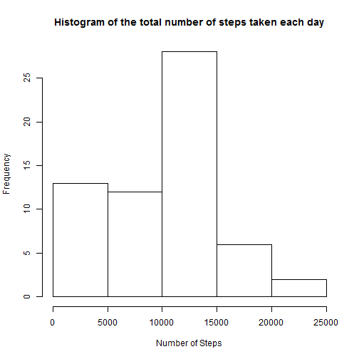
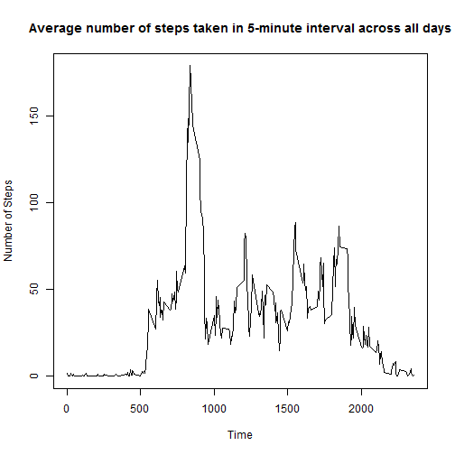
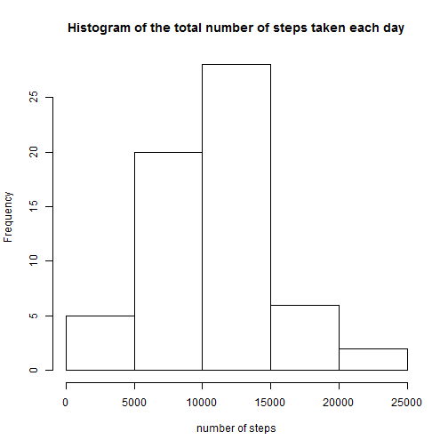
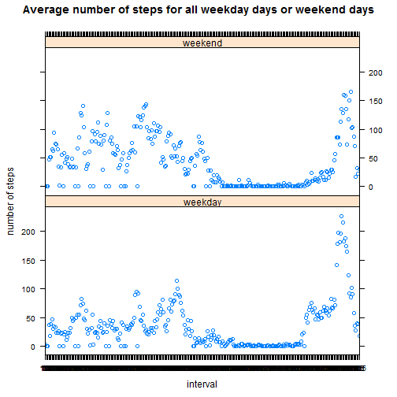

**Loading and preprocessing the data**  


```r
setwd("C:\\Data Science\\Coursera\\John Hopkins\\Reproducible Research\\Peer Assessments 1")
activity = read.csv("activity.csv")
summary(activity)
```

```
##      steps                date          interval     
##  Min.   :  0.00   2012-10-01:  288   Min.   :   0.0  
##  1st Qu.:  0.00   2012-10-02:  288   1st Qu.: 588.8  
##  Median :  0.00   2012-10-03:  288   Median :1177.5  
##  Mean   : 37.38   2012-10-04:  288   Mean   :1177.5  
##  3rd Qu.: 12.00   2012-10-05:  288   3rd Qu.:1766.2  
##  Max.   :806.00   2012-10-06:  288   Max.   :2355.0  
##  NA's   :2304     (Other)   :15840
```

**Mean total number of steps/day**  
*Below code calculates the Total steps/ day and plots a histogram. Also, the mean and median of the Total steps are shown.*


```r
TotalSteps = tapply(activity$steps,activity$date, sum, na.rm=TRUE, simplify = TRUE)
hist(TotalSteps,xlab = "Number of Steps", main = "Histogram of the total number of steps taken each day")
```

 

```r
mean(TotalSteps)
```

```
## [1] 9354.23
```

```r
median(TotalSteps)
```

```
## [1] 10395
```

**Average daily pattern **  
*StepAverage calculates average number of steps taken in 5-minute interval across all days and then plots a time series.*


```r
activity$interval <- as.factor(activity$interval)
StepAverage <- tapply(activity$steps, activity$interval, sum, na.rm = TRUE,  simplify = TRUE)/length(levels(activity$date))

plot(x = levels(activity$interval), y = StepAverage, type = "l", xlab = "Time", 
    ylab = "Number of Steps", main = "Average number of steps taken in 5-minute interval across all days")
```

 

**Imputing missing values**


```r
MissingValues = sum(as.numeric(is.na(activity$steps)))

original_data <- activity
for (i in 1:length(activity$steps)) {
    if (is.na(activity$steps[i])) {
        for (j in 1:length(StepAverage)) {
            if (as.character(activity$interval[i]) == names(StepAverage[j])) 
                activity$steps[i] = StepAverage[j]
        }
    }
}
clean_data <- activity

clean_step_sum <- tapply(clean_data$steps, clean_data$date, sum, na.rm = TRUE, 
    simplify = TRUE)
hist(clean_step_sum, xlab = "number of steps", main = "Histogram of the total number of steps taken each day")
```

 

```r
mean(clean_step_sum)
```

```
## [1] 10581.01
```

```r
median(clean_step_sum)
```

```
## [1] 10395
```
*The mean and median total number of steps taken per day are 10581.01 and 10395. Compared with the estimates from the first part of the assignment, the difference of mean and median value are -1226.7842 and 0. We find that the shape of two histograms change a little, especially for the number of steps below 10000. The median value have no difference from the estimates from the first part of the assignment. However, the mean value increase significantly. Therefore, after imputing missing data, the total daily number of steps increase a little.*

**Differences in activity patterns between weekdays and weekends**  
*At first, we create a new factor variable in the dataset with two levels, weekday and weekend indicating whether a given date is a weekday or weekend day. Then we make a panel plot containing a time series plot of the average number of of steps taken in each 5-minute interval across all weekday days or weekend days.*


```r
Sys.setlocale("LC_TIME", "en")
```

```
## Warning in Sys.setlocale("LC_TIME", "en"): OS reports request to set
## locale to "en" cannot be honored
```

```
## [1] ""
```

```r
weekday <- weekdays(as.Date(clean_data$date, "%Y-%m-%d"))
for (i in 1:length(weekday)) {
    if ((weekday[i] == "Saturday") | (weekday[i] == "Sunday")) 
        weekday[i] = "weekend" else weekday[i] = "weekday"
}
clean_data$weekday <- as.factor(weekday)

clean_data2 <- split(clean_data, clean_data$weekday)
weekday <- clean_data2$weekday
weekend <- clean_data2$weekend
step_average_weekday <- tapply(weekday$steps, weekday$interval, sum, simplify = TRUE)/(length(weekday$weekday)/288)
step_average_weekend <- tapply(weekend$steps, weekend$interval, sum, simplify = TRUE)/(length(weekend$weekday)/288)
output <- data.frame(steps = c(step_average_weekday, step_average_weekend), 
    interval = c(levels(activity$interval), levels(activity$interval)), weekday = as.factor(c(rep("weekday", 
        length(step_average_weekday)), rep("weekend", length(step_average_weekend)))))
library(lattice)
xyplot(steps ~ interval | weekday, data = output, layout = c(1, 2), ylab = "number of steps", 
    main = "Average number of steps for all weekday days or weekend days")
```

 
